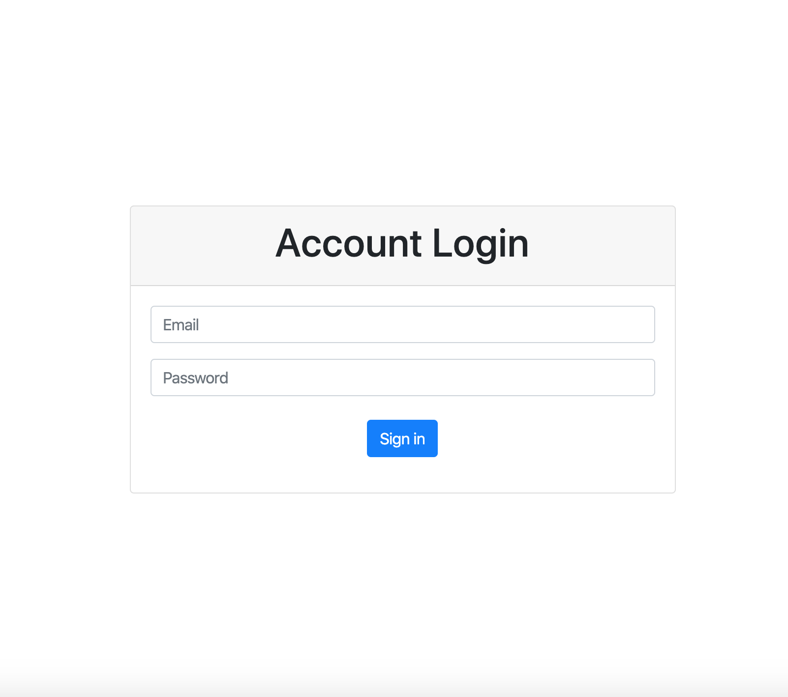

# Project Title

基本登入頁面

## Features
- 使用者輸入帳密：email & password
- 如果找不到 username，或是 password 錯誤，介面會顯示 "Username/Password 錯誤"
- 如果 username + password 組合正確，使用者就能成功登入，並導向自己的 welcome page，在此頁面上會顯示登入使用者的 firstName

## Installation
1. 從github下載此專案至本機電腦

  `git clone https://github.com/henry22/basic_account_login.git`

2. 開啟Terminal，進入此專案

  `cd basic_account_login`

3. 使用npm安裝所有相依套件

  `npm install`

4. 執行專案

  `npm run dev`

5. 開啟網址在本機端

  `http://localhost:3000`

6. 在終端機中輸入Ctrl+C可停止伺服器運行

## Testing accounts
名稱          | 信箱  | 密碼
--------------|:-----:|------------------------
Tony    | tony@stark.com | iamironman
Steve   | captain@hotmail.com | icandothisallday
Peter   | peter@parker.com | enajyram
Natasha | natasha@gamil.com | *parol#@$!
Nick    | nick@shield.com | password

## Environment
- Express

### packages
- body-parser
- express-handlebars